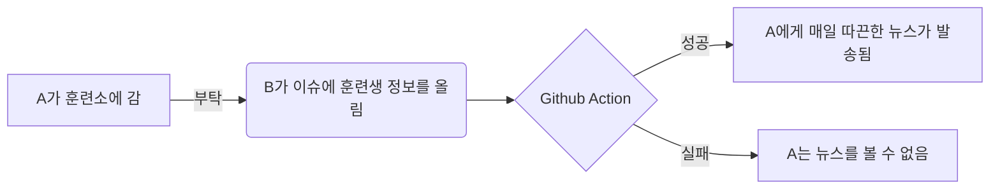

# nonsan-trainee-news

Using [this](https://github.com/lewisleedev/thecampy) library for sending daily news to trainees.

```
```

## Flow
1. 훈련소에 들어가기 전에 Github에 Issue를 작성할 줄 아는 지인을 구한다.
2. 훈련생의 정보가 열리면 지인이 [Issue](https://github.com/guzus/nonsan-trainee-news/issues/1)에 있는 table에 훈련소에 간 훈련생의 정보를 업데이트 한다.
3. Github Action이 예약된 시간에 돌면서 Issue에 써있는 훈련생들에게 편지를 발송한다. (프리티어 한도 초과 / 훈련생 정보 불일치 / 편지 발송 한도 초과 등의 이유로 실패할 수 있음)


