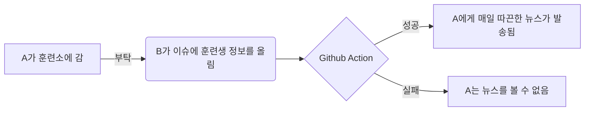

# nonsan-trainee-news

Using [this](https://github.com/lewisleedev/thecampy) library for sending daily news to trainees.

## Flow

```mermaid
flowchart LR
A[A가 훈련소에 감] -->|부탁| B(B가 이슈에 훈련생 정보를 올림)
B --> C{Github Action}
C -->|성공| D[A에게 매일 따끈한 뉴스가 발송됨]
C -->|실패| E[A는 뉴스를 볼 수 없음]
```
