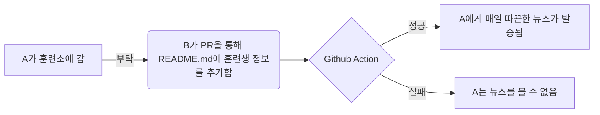

# nonsan-trainee-news

Using [this](https://github.com/lewisleedev/thecampy) library for sending daily news to trainees.

## Flow

## 훈련생 목록
매일 12시에 아래 표의 훈련생들에게 뉴스가 인터넷 편지 형태로 발송됩니다.
인터넷 편지를 발송할 훈련생의 정보를 추가하고 PR을 올려주세요.
| 이름  | 생일(yyyymmdd) | 입대일(yyyymmdd) | 부대명(ex: 육군훈련소) | groupName | unitName
| ------------- | ------------- | ------------- | ------------- | ------------- | ------------- |
| Content Cell  | Content Cell  | Content Cell  | Content Cell  | Content Cell  | Content Cell  |
| Content Cell  | Content Cell  | Content Cell  | Content Cell  | Content Cell  | Content Cell  |